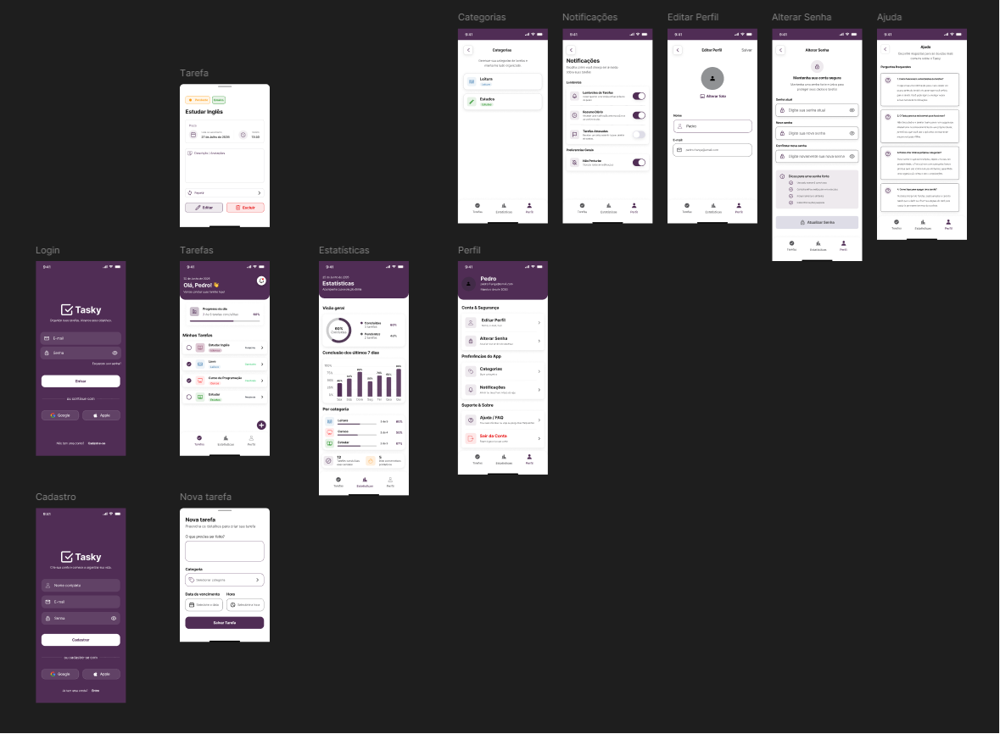

# 📱 Tasky

📱 Tasky

[Flutter]
[SQLite]
[Dart]
[Em Desenvolvimento]

> **Organize hoje. Evolua todos os dias.**

Um aplicativo de gerenciamento de tarefas desenvolvido com **Flutter** e **SQLite**, criado para oferecer uma experiência simples, intuitiva e totalmente offline.

---

## 📖 Sobre o Projeto

O Tasky nasceu inicialmente como um projeto de portfólio com o objetivo de praticar o desenvolvimento mobile utilizando Flutter e SQLite.

Durante seu desenvolvimento, novas ideias surgiram e o projeto evoluiu além da proposta inicial. O que começou como um simples aplicativo de tarefas tornou-se um ambiente completo de estudo em desenvolvimento mobile, banco de dados, arquitetura de software e boas práticas de engenharia.

Cada funcionalidade foi planejada pensando na experiência do usuário, mantendo a simplicidade de uso sem abrir mão da organização, qualidade e evolução contínua do software.

---

## 🎯 Objetivo

Desenvolver um aplicativo que permita ao usuário organizar suas tarefas diárias, acompanhar seu progresso e manter uma rotina mais produtiva através de lembretes, estatísticas e uma interface intuitiva.

Além disso, este projeto representa minha evolução como desenvolvedor, reunindo conhecimentos em Flutter, SQLite, Git e Engenharia de Software em uma aplicação desenvolvida do planejamento até a documentação.

---

## ✨ Funcionalidades

- ✅ Cadastro de usuários
- ✅ Login
- ✅ Gerenciamento de tarefas
- ✅ Categorias
- ✅ Notificações
- ✅ Estatísticas de produtividade
- ✅ Perfil do usuário
- ✅ Funcionamento offline

---

## 🛠️ Tecnologias

- Flutter
- Dart
- SQLite
- Git
- GitHub
- Figma

---

## 🎨 Interface

### Protótipo desenvolvido no Figma

O design do Tasky foi desenvolvido no Figma com foco em simplicidade, organização e experiência do usuário.

<p align="center">
  
</p>

---

## 📂 Estrutura do Projeto

```text
Tasky
│
├── docs
├── lib
├── assets
├── test
└── README.md
```

---

## 📚 Documentação

A documentação completa do projeto está disponível na pasta **docs**, contendo:

- Visão Geral
- Requisitos
- Arquitetura
- Banco de Dados
- Decisões Técnicas
- Roadmap
- Diário de Desenvolvimento (DevLog)
- Aprendizados

---

## 📈 Status do Projeto

> **O projeto está em desenvolvimento contínuo. Abaixo estão as principais etapas planejadas.**

- ✅ Planejamento
- ✅ Documentação inicial
- 🟨 Modelagem do banco de dados
- ⬜ Desenvolvimento Flutter
- ⬜ Sistema de notificações
- ⬜ Estatísticas
- ⬜ Testes
- ⬜ Versão 1.0

---

# 🚀 Filosofia do Projeto

O Tasky não é apenas um aplicativo de gerenciamento de tarefas.

Ele é um projeto desenvolvido com foco em boas práticas de engenharia de software, documentação e evolução contínua.

Cada decisão tomada durante seu desenvolvimento é registrada e documentada, permitindo compreender não apenas o resultado final, mas também o motivo por trás de cada escolha.

> **"Construindo software de forma organizada, uma decisão por vez."**

---

## 👨‍💻 Desenvolvedor

Desenvolvido por **Pedro Henrique Francozo** como projeto de estudo e portfólio, aplicando conceitos de Engenharia de Software, Flutter, SQLite e boas práticas de desenvolvimento.

O objetivo é construir uma aplicação completa, documentando todo o processo de evolução do projeto.
